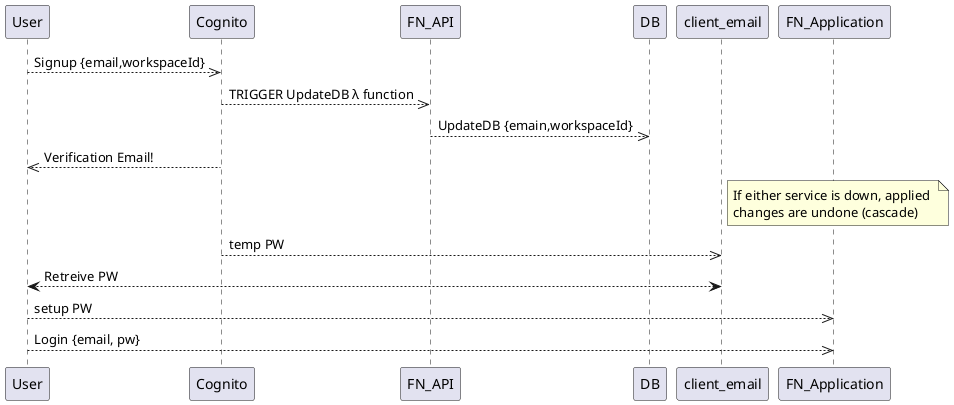

## Signup

AWS Congito is used for authentication. Clients utilize Cognito directly to be authenticated. 

The generated tokens (ID Token,  Access Token, Refresh Token, JWT) are used to authenticate users into the API endpoints. 

The JWT is verified utilizing the common AWS guidelines, [stated here](https://docs.aws.amazon.com/cognito/latest/developerguide/amazon-cognito-user-pools-using-tokens-with-identity-providers.html). The logic is implemented through the [JWTMiddleware](../src/facet.ninja/api/middleware/JWTMiddleware.go).

Sequence diagram Signup:

## Signup a test account

// TODO script