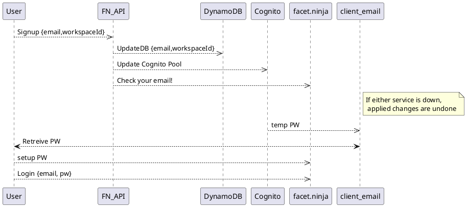

## Signup

```plantuml
   @startuml
    !$CE = "client_email"
    !$C = "User"
    !$Admin = "facet.ninja"
    !$API = "FN_API"
    !$DB = "DynamoDB"
    !$CO = "Cognito"

    $C-->>$API: Signup {email,workspaceId}
    $API-->>$DB: UpdateDB {email,workspaceId}
    $API-->>$CO: Update Cognito Pool
    $API-->>$Admin: Check your email!
    Note right of $CE: If either service is down,\n applied changes are undone
    $CO-->>$CE: temp PW
    $C<-->$CE: Retreive PW
    $C-->>$Admin: setup PW
    $C-->>$Admin: Login {email, pw}
@endtuml
```